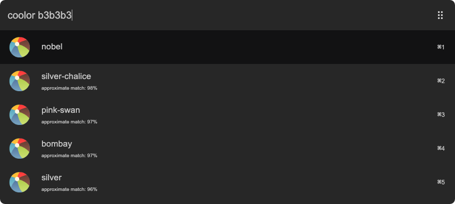

# arvis-coolors

> Color name generator for [Arvis](https://github.com/jopemachine/arvis)



## 🔗 This workflow is converted from [alfred-workflow](https://github.com/radibit/alfred-coolors).

* Note that there might be some code change or different actions from the original workflow.

* Marked original workflow's creator to author.

## Install

```
$ npm i -g arvis-coolors
```

*Requires [Node.js](https://nodejs.org) 4+.*


## Usage

In Arvis, type `coolor`, <kbd>Enter</kbd>, and color in HEX format 🎉

Select a color and press <kbd>Enter</kbd> to copy it to the clipboard.

There is also support for HSL, RGB, and RGBA.

Each result contains an approximate match in percentages.
It uses [Euclidean distance](https://en.wikipedia.org/wiki/Euclidean_distance#Three_dimensions) to calculate how close is the selected color to a set of defined colors with names.

Thanks to @zeke and his [color-namer](https://github.com/zeke/color-namer) package 🙌

## License

MIT © [radibit](https://radibit.com)
